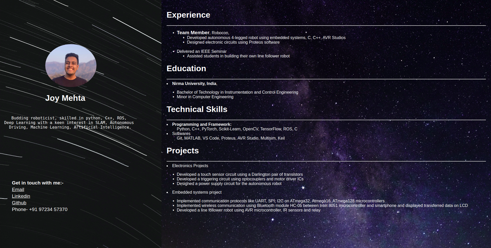
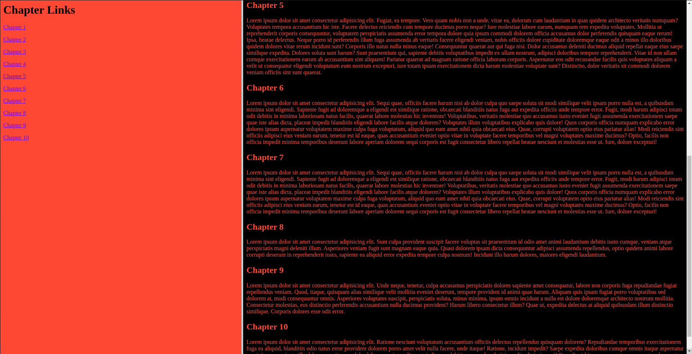
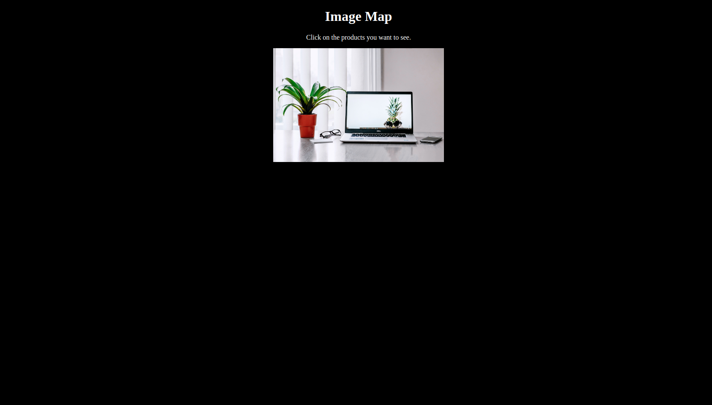

# Projects from Internet and Web Development Course.
1.  HTML Basics
    * Headings
    * Paragraphs
    * Images
    * Links

2. Practical 2
    * Resume
        <dd>Created a webpage which displayed my resume using html and css.
    

    * Frame Set
        <dd>Used frameset to display multiple sectons in a single webpage and openend link from one frame in another frame at a specific position.
    

3. Practical 3
    * Image Map
        <dd>Created an image map which when clicked on opens a amazon link to buy the the product.
        
    

4. [Youtube Tutorial](https://www.youtube.com/watch?v=mU6anWqZJcc&t=4205s)
    <dd> Codes and projects from a youtube tutorial on HTML and CSS.